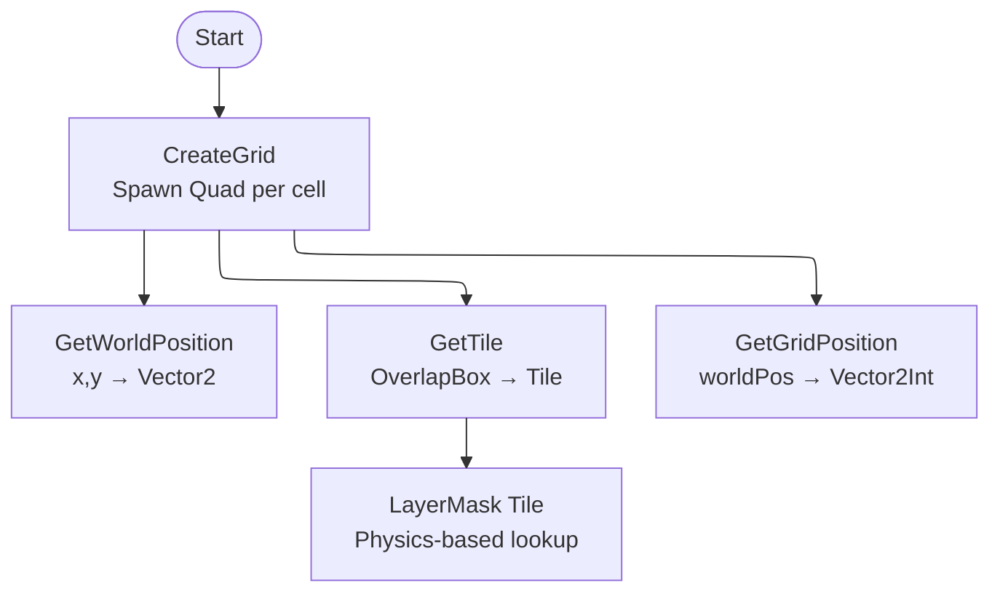
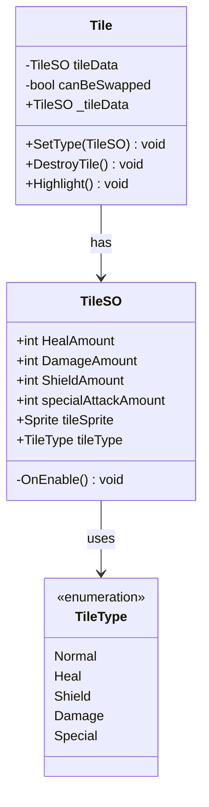
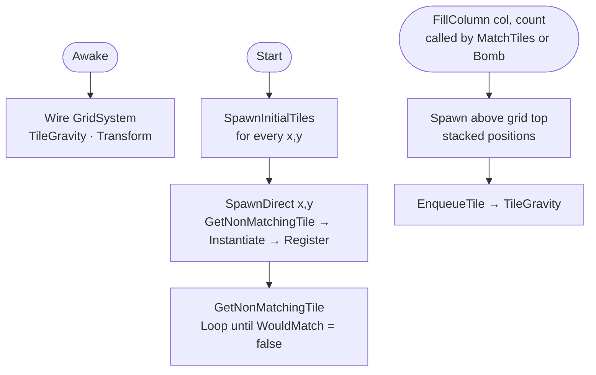
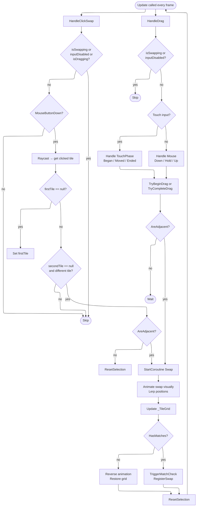
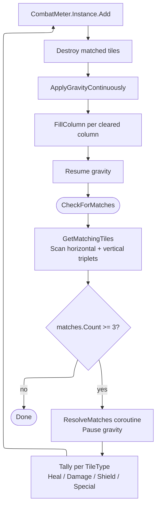

# ExamenGame

### Beschrijving
We hebben de opdracht gekregen van de klant om een Match 3 te maken waar complete artistieke creativiteit aan ons is gegeven buiten de Match 3, 
waarbij we ervoor gekozen hebben om een Space Themed Dungeon ish Crawler .te maken

# Geproduceerde Game Onderdelen

Gino Schaap:
  * [Grid System](https://github.com/TheGingino/ExamenGame/blob/Develop/Match-3-Team2/Assets/Scripts/Match3/TileS/GridSystem.cs)
  * [Tiles](https://github.com/TheGingino/ExamenGame/blob/Develop/Match-3-Team2/Assets/Scripts/Match3/TileS/Tile.cs)
  * [Swap Tiles](https://github.com/TheGingino/ExamenGame/blob/Develop/Match-3-Team2/Assets/Scripts/Match3/TileS/SpawnTiles.cs)
  * [MatchTiles](https://github.com/TheGingino/ExamenGame/blob/Develop/Match-3-Team2/Assets/Scripts/Match3/TileS/MatchTiles.cs)
  * [Tile Gravity](https://github.com/TheGingino/ExamenGame/blob/Develop/Match-3-Team2/Assets/Scripts/Match3/TileS/TileGravity.cs)
  * [Bomb](https://github.com/TheGingino/ExamenGame/blob/Develop/Match-3-Team2/Assets/Scripts/PowerUp/Bomb.cs)
  * [Save System](https://github.com/TheGingino/ExamenGame/blob/Develop/Match-3-Team2/Assets/Scripts/SaveSystem/SaveSystem.cs)
  * [Level Selection Scroll]()
  * [Framerate Display](https://github.com/TheGingino/ExamenGame/blob/Develop/Match-3-Team2/Assets/Scripts/FrameCheck.cs)
  * [Level Creator]()

Julie Jaasma:
  * [Start Screen](https://github.com/TheGingino/ExamenGame/blob/Develop/Match-3-Team2/Assets/Scripts/Menu/StartScreen.cs)
  * [Options Menu](https://github.com/TheGingino/ExamenGame/blob/Develop/Match-3-Team2/Assets/Scripts/Menu/MenuSlider.cs)
  * [Enemy Behaviour](https://github.com/TheGingino/ExamenGame/tree/Develop/Match-3-Team2/Assets/Scripts/Enemy)
  * [Enemy Health](https://github.com/TheGingino/ExamenGame/blob/Develop/Match-3-Team2/Assets/Scripts/Enemy/EnemyHealth.cs)
  * [Enemy Attack](http://github.com/TheGingino/ExamenGame/blob/Develop/Match-3-Team2/Assets/Scripts/Enemy/EnemyAttack.cs)
  * [Player Behaviour](https://github.com/TheGingino/ExamenGame/tree/Develop/Match-3-Team2/Assets/Scripts/Player)
  * [Player Health](https://github.com/TheGingino/ExamenGame/blob/Develop/Match-3-Team2/Assets/Scripts/Player/PlayerHealth.cs)
  * [Player Attack](https://github.com/TheGingino/ExamenGame/blob/Develop/Match-3-Team2/Assets/Scripts/Player/PlayerAttack.cs)
  * [Player Shield](https://github.com/TheGingino/ExamenGame/blob/Develop/Match-3-Team2/Assets/Scripts/Player/PlayerShield.cs)
  * [HealthBar](https://github.com/TheGingino/ExamenGame/blob/Develop/Match-3-Team2/Assets/Scripts/Player/HealthBar.cs)
  * [Combat Meter Bars](https://github.com/TheGingino/ExamenGame/blob/Develop/Match-3-Team2/Assets/Scripts/Abilities/CombatMeterBar.cs)
  * [Charge Visuals](https://github.com/TheGingino/ExamenGame/blob/Develop/Match-3-Team2/Assets/Scripts/UI/Charges.cs)
     
Nikki van Wijngaarden:
 * [TileSO](https://github.com/TheGingino/ExamenGame/blob/Develop/Match-3-Team2/Assets/Scripts/Match3/TileS/TileSO.cs)
 * [AbilitieCounterUI](https://github.com/TheGingino/ExamenGame/blob/Develop/Match-3-Team2/Assets/Scripts/Abilities/AbilitieCounterUI.cs)
 * [SwapTiles](https://github.com/TheGingino/ExamenGame/blob/Develop/Match-3-Team2/Assets/Scripts/Match3/TileS/SpawnTiles.cs)
 * [CombatMeter](https://github.com/TheGingino/ExamenGame/blob/Develop/Match-3-Team2/Assets/Scripts/Match3/TileS/CombatMeter.cs)
 * [PlayerAttack](https://github.com/TheGingino/ExamenGame/blob/Develop/Match-3-Team2/Assets/Scripts/Player/PlayerAttack.cs)
 * [PlayerHealth](https://github.com/TheGingino/ExamenGame/blob/Develop/Match-3-Team2/Assets/Scripts/Player/PlayerHealth.cs)
 * [PlayerShield](https://github.com/TheGingino/ExamenGame/blob/Develop/Match-3-Team2/Assets/Scripts/Player/PlayerShield.cs)

Kiana (Jasper) Hiemstra:
  * [Level Selection Screen (OLD)]()
  * [Turn Based System](https://github.com/TheGingino/ExamenGame/blob/Develop/Match-3-Team2/Assets/scripts/TurnSystem/TurnManager.cs)
  * [Win Lose Condition](https://github.com/TheGingino/ExamenGame/blob/Develop/Match-3-Team2/Assets/Scripts/Menu/GameEndManager.cs)
  * [Tutorial](https://github.com/TheGingino/ExamenGame/blob/Develop/Match-3-Team2/Assets/Scripts/Menu/TutorialManager.cs)
  * [Main Scene]()
    
Bo Bakker:
* enemy model
* boss enviroment
* tutorial
* health bar
* slash animation
* special attack animation
* game border
* damage rim
 
Robin van Wandelen:
*

 Guilherme Loures Oliveira
 * Grid visuals
 * Move counter
 * Energy counter
 * Turn indicator
 * Settings button
 * Ability button
 * Ability charges
 * Bomb

Min van der Veen:
 * Beginscherm
 * Level select scherm
 * Wapen
 * UI knoppen
 * Pause screen/ win-lose screen
 * Level 2 Environment
   
## 1. Grid System

Het spel speelt zich af op een rechthoekig grid. Het grid heeft een vaste breedte, hoogte en celgrootte die samen de speelruimte bepalen. Elke cel op het grid kan een Tile bevatten.

---

## 2. Tile Types

Elke Tile heeft een type dat bepaalt hoe hij eruit ziet en hoe hij zich gedraagt. Het type wordt meegegeven als data aan de Tile zodat het spel altijd weet wat voor soort Tile er op een plek staat. Je hebt 5 soorten Tiles: Attack Tile, Shield Tile, Heal Tile, Special Tile en een Filler Tile. ze bouwen allemaal een bar op behalve de filler. Die is er puur om de grid te vullen met extra tiles.

---

## 3. Tile Spawning

Tiles spawnen op lege plekken in het grid met een black hole-effect zodat het visueel aantrekkelijk oogt. Bij de start van een level wordt het volledige grid gevuld. Wanneer Tiles verdwijnen na een match, worden de vrijgekomen plekken direct weer opgevuld. Er spawnt nooit een Tile die direct een match vormt.

---

## 4. Tile Swapping

De speler verplaatst Tiles door ze te verwisselen met een aangrenzende Tile. Als de wissel geen match oplevert, schuift de Tile automatisch terug naar zijn originele positie. Alleen Tiles die grenzen aan de geselecteerde Tile kunnen gewisseld worden.

---

## 5. Tile Match Check

Zodra een swap is uitgevoerd, controleert het spel automatisch of er een match aanwezig is. Een match is een aaneengesloten reeks van drie of meer Tiles van hetzelfde type. De posities van gematchte Tiles worden opgeslagen, waarna die Tiles worden verwijderd en nieuwe Tiles spawnen op de vrijgekomen plekken.

---

## 6. Deadlock System

Als er geen geldige zetten meer mogelijk zijn op het board, shufflet het board automatisch. De speler kan dan niet meer zetten totdat de shuffle klaar is. De shuffle zorgt er altijd voor dat er daarna geldige zetten beschikbaar zijn. Een Tile Limiter houdt bij of er nog zetten mogelijk zijn.

---
## Tile Gravity
Zodra er tiles gebroken worden spawnen er niet alleen nieuwe tiles in, ze vallen ook van boven naar beneden en de tiles die boven de gebroken tiles stonden vallen dan op de plek van de verwijderde tiles. Het spawnt van column naar column.

---

## Bomb Powerup
De bomb doet een ding en dat is een 3x3 range van tiles op de grid kapot maken. Hij kan ook minder verwijderen als je hem ver boven zet. Je hebt een use per level tenzij je er meerdere zou kunnen unlocken. 

![Bomb][https://github.com/TheGingino/ExamenGame/blob/Develop/WikiResources/Gino/Bomb.gif]

---

## 7. Turn Based Rounds

Het spel verloopt in beurten. Per beurt heeft de speler vijf sets om zetten te doen en matches te maken. Na die vijf sets voert de vijand een aanval uit. De hoeveelheid schade die de vijand doet hangt af van of de Block Slider vol is. Daarna begint een nieuwe beurt.

---

## 8. Enemy Boss

De vijand is een boss met een vaste set aan aanvallen. Elke beurt kiest de boss willekeurig één aanval uit zijn movepool. De schade van die aanval wordt beïnvloed door de Block Slider van de speler.

---

## 9. Tile PowerUp Slider

De speler heeft een PowerUp Slider die oplaadt naarmate er matches worden gemaakt. Wanneer de slider vol is, kan de speler een speciale move activeren via een knop of slider in de HUD. De Block Slider werkt op dezelfde manier en vermindert de schade van de boss wanneer hij vol is.

---

## 10. Screens

### Start Screen
Het eerste scherm dat de speler ziet. Bevat drie knoppen:
- **Play** → [Level Selection Screen](#level-selection-screen)
- **Options** → Opent het instellingenmenu
- **Quit** → Sluit het spel af

---

### Level Selection Screen
Scherm waar de speler een level kiest. Het aantal level-knoppen past zich automatisch aan op het totale aantal beschikbare levels.
- **Level [X]** → Start het gekozen level
- **Back** → [Start Screen](#start-screen)

---

### Death Screen
Wordt getoond wanneer de speler het level verliest. Er staat een tekst die aangeeft dat de speler heeft verloren.
- **Retry** → Herstart het huidige level
- **Menu** → [Start Screen](#start-screen)

---

### Win Screen
Wordt getoond wanneer de speler het level wint. Er staat een tekst die aangeeft dat de speler heeft gewonnen.
- **Retry** → Herstart het huidige level
- **Menu** → [Start Screen](#start-screen)

---

### Tutorial Screen
Een apart scherm dat uitlegt hoe het spel werkt. De speler krijgt stap voor stap uitleg over de belangrijkste mechanics zoals Tile Swapping, matches maken en hoe de sliders werken. Er zijn geen chains of complexe mechanics actief tijdens de tutorial.
- **Terug** → [Start Screen](#start-screen)

---

### Save System
De game heeft een save system voor het geval er meerdere levels komen. Zodra je een level verslaat unlock je de volgende level en dan wordt de knop van de level klikbaar en er is ook een knop om het te resetten zodat je opnieuw kan spelen.

---

### Level Creator
Het doel was om meerdere levels te maken en daarvoor is een LevelCreator voor gemaakt dat een Tool Window is waarbij je met knoppen kan klikken welke prefabs je er in wilt hebben. Je kan ook de naam kiezen van de level en als je op Create klikt wordt de scene gemaakt in een folder genaamd Levels en dat is ook zichtbaar op de Tool Window.

---
## Tile grid visuals
De tile grid is natuurlijk waar de gameplay zelf speelt hiervoor hebben wij art nodig om de vershilende soorten tiles te onderschieden. Rood voor attack, Blauw voor shield, Groen voor healing, Wit als een filler tile en geel voor special attack.

## Move counter & Energy counter

Move Counter
De move counter laat zien hoeveel zetten de speler nog kan doen voordat de enemy aanvalt.

Energy Counter
De energy counter laat zien dat de speler 3 abilities kan gebruiken per beurt.
Als er een ability gebruikt is, word 1 van de buttons donker van kleur.

## Turn indicator
De turn indicator geeft aan of de speler aan zet is of dat de enemy aan de beurt is.

## Setting button
Door op deze knop te drukken word het optie menu geopend

## Ability buttons & Ability charger
Door op 1 van deze knoppen te drukken word de bijbehorende ability geactiveerd. 
De charge visuals laten zien hoeveel charges de speler verzameld heeft.

## Bomb Visual
De bomb kan op de grid gesleept worden door de speler. Dan worden er in 1 keer meerdere tiles gebroken.

---

## Beginscherm 
Elke game heeft wel een beginscherm. Het is het eerste dat je ziet als je een game start. Het moet de sfeer vertellen van de game en waar het over gaat. Ik heb 6 concepten gemaakt voor het beginscherm. Na ee poll om te stemmen kwam er een uitslag. Na verschillende concepten van het ruimteschip en nog een poll verder is er een winner. 

 

## Level select scherm
Nadat je het beginscherm heb gehad en je wilt verder ga je naar een scherm waar je de levels kan zien. Het level select scherm laat je alle levels zien die bestaan/je kan spelen. Ik heb hier ook concepten voor gemaakt en een poll gecreeerd waar een winner op was besloten. Ook als game hadden we besloten dat je begint helemaal onderaan in het ruimteschip en jemoet door het ruimteschip gaan waar je in verschillende kamers komt met levels waar je dingen moet verslaan. 

## Wapen
In een eerdere versie van het concept was dat de speler een wapen heeft waarmee je je mee kan verdedigen. Als je attack balkje vol is door de match 3 de spelen dan kon je aanvallen met het wapen.

## UI knoppen
Voor het startscherm en level select scherm moeten er knoppen komen om op te klikken om verder te gaan in het spel. 

## Pause screen
Als je het spel op pause zet dan krijg je een menu met opties. Dit is de UI.

## Enviroment Boss level
Sinds wij begonnen bij het boss level was daar ook meteen een environment voor nodoig. We hadden als idee voor de environment dat je door het schip heen loopt van begin tot eind. Daarom hebben we de boss level in het puntje van het schip gezet, vaak omdat dat de belangrijkste ruimte is ivm besturing. Hier zijn ook concepten voor gemaakt waaruit de favoriete is gekozen door ons team. Dit is het level waar onze boss in staat en welke de speler het meeste terugziet. 

## Environment level 2
We hadden best wel veel tijd over dus er zijn ideen voor een 2e level. Omdat we als idee had dat je door het schip moet lopen en de eindbaas in de top zit, was de environment best wel vast in welke kamer het is. Daarom zijn er weinig variatie met vorm. Ik heb er concepten voor gemaakt, er is weer gestemt op een eindresultaat. 

## Enemy model
Onze antagonisten in de game zjin aliens. Daarom hebben we voor de boss level een groot en sterke alien gekozen. Die alien kan jou als speler aanvallen en jij kan hem terug aanvallen. Er is veel gespeeld met lichaamshouding en met kleuren theorie. Hij staat met de borst naar voren wat hem intimiderend maakt en heeft koude kleuren wat hem er kil uit laat zien. 

Daarnaast heeft de alien ook een rig voor de animaties zodat hij kan bewegen. Dit maakt het model levendiger en interessanter voor de speler. 

## Tutorial

Om het voor de speler zo duidelijk mogelijk te maken hoe de game werkt hebben wij een tutorial aan de game toegevoegd. De tutorial start aan het begin van het level en de speler kan zelf kiezen of die hem wilt skippen en hoe snel hij door de tutorial heen wilt gaan. 

## Slash animation
Wanneer de speler de enemy aanvalt, komt deze animatie in het scherm. Het zorgt ervoor dat de speler meer visual feedback heeft over het aanvallen en het ziet er interessanter uit.

## Special attack animation
Wanneer de speler de enemy aanvalt met een special attack, komt deze animatie in het scherm. Het zorgt ervoor dat de speler meer visual feedback heeft over het aanvallen en het ziet er interessanter uit.

## health bar
Om duidelijk health van de speler en de enemy te kunnen aangeven, hebben wij gebruik gemaakt van health bars. Als de speler volle health heeft, dan is de bar vol. Wanneer de speler damage neemt loopt de bar een beetje leeg. Als de bar leeg is, dan is de speler dood. Dit geldt ook voor de enemy. Het verschil tussen de 2 is dat de enemy healthbar een icon heeft om aan te geven dat dat die van hem is voor duidelijkheid.

Daarnaast is er ook een healthbar die blauw is die aangeeft wanneer de shield geactiveerd is

## border
Om de artstyle en de game bij elkaar te brengen hebben wij gebruik gemaakt van een game border. Deze maakt het spel visueel interessanter en zorgd voor een afgemaakte look in het spel 

## damage rim
Zodat de speler meteen en duidelijk weet dat hij damage heeft genomen, hebben wij een damage rim gemaakt. Deze komt snel te voorschijn wanneer de alien de speler aanvalt. De rim gaat over het hele scherm zodat de speler het niet kan missen.

